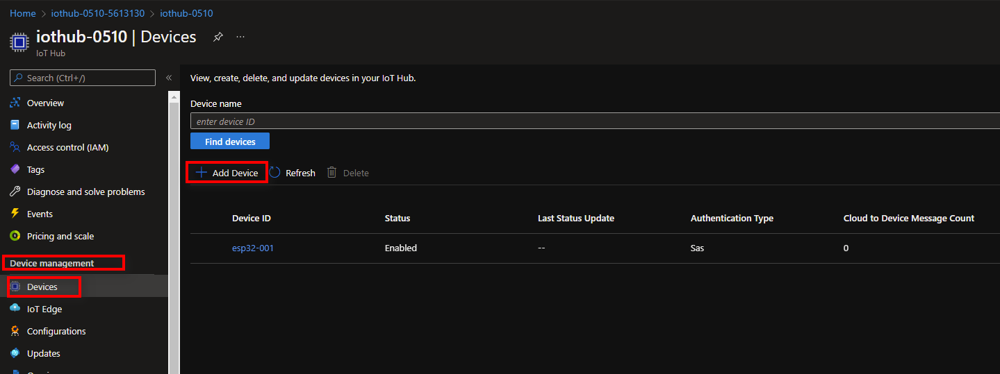

# Lab 1 - Connect ESP32 Devkit using Azure IoT Middleware for FreeRTOS

## 1. Prerequisite:

### Hardware
- ESPRESSIF ESP32 Azure IoT Devkit
  
    

- Micro USB cable

    

- Wi-Fi Router: 2.4 GHz
- Laptop: Windows 10 or 11 Pro


### Software
- Python:
  
  Download and install Python 3.8 from [HERE](https://www.python.org/ftp/python/3.8.9/python-3.8.9-amd64.exe) if not yet.

- Git:
  
  Download and install Git v2.3.6 from [HERE](https://github.com/git-for-windows/git/releases/download/v2.36.0.windows.1/Git-2.36.0-64-bit.exe) if not yet.

- ESP-IDF v4.3.2:
  
  You may download it from [HERE](https://dl.espressif.com/dl/esp-idf/?idf=4.4) if not yet. 
  
  Install it to `c:\` once downloaded. 

- Sample Repo:
  
  Download the sample repo from [HERE](https://github.com/Azure-Samples/iot-middleware-freertos-samples/tree/main/demos/projects/ESPRESSIF/aziotkit) to local machine.


- Azure Susbscription:
  
  Make sure you have an active Azure Susbscription.

- Azure IoT Explorer:
  
  Download and install v0.14.5 from [HERE](https://github.com/Azure/azure-iot-explorer/releases/download/v0.14.5/Azure.IoT.Explorer.preview.0.14.5.msi) if not yet.

## 2. Create and configure Azure IoT Hub

### 2.1 Create IoT Hub
- Login to Azure Portal using your Azure Subscription.
- Search `IoT Hub` and click `Create`. Create a new Resource Group `DevHack0510` -> Enter a name for your IoT Hub: `iothub-0510` -> Select Region: `Southeast Asia` -> click `Review + Create` -> click `Create`.


### 2.2 Create IoT Hub device


- Open `iothub-0510` once created -> `Security settings` -> `Shared access policies` -> Manage shared access policies -> click `iothubowner`.
  
  

  Make a note of the connection string.

  
- Go to `Device Management` -> click `Devices` -> Click `+ Add Device` -> enter Device ID: `esp32-001` -> click `Save`. 

- Once created, you will see:

    

- Click `esp32-001` and make a note of below:
  - Device ID: `esp32-001`
  - Primary Key: `oSGa*****************dqY=`


## 3. Build and flash the image

### 3.1 Prepare the sample

- Unzip the repo to `c:\`.

- Double click to run `ESP-IDF 4.3 CMD` from your desktop and navigate to `c:\`.

    

- Navigate to sample repo directory: 
  
  ```
  cd iot-middleware-freertos-samples\demos\projects\ESPRESSIF\aziotkit\

  ```

- Run below commands:
  
  ```
  idf.py menuconfig
  ```
  
### 3.2 Update the configuration

On `Espressif IoT Development Framework Configuration` UI, you may need to update below settings:

- **Azure IoT Middleware for FreeRTOS Main Task Configuration**

  
    Move cursor to `Azure IoT middleware Main Task Configuration` and click `ENTER` -> Enter IoT Hub FQDN: `iothub-0510.azure-devices.net` -> Enter Device ID: `esp32-001` -> Enter Device Key: `oSGa************dqY=`.


  
   
- **Azure IoT middleware for FreeROTS Sample Configuration**
    
    Update the `WiFi SSID` and `WiFi Password` from here.
    
    


- **Compiler options**
  
  Change to `Optimize for size (-Os)`.
     
    
    

- Press key `Q` and then `S` to exit the command line.


## 3.3 Build the image


- Run below commands to build the image.
    
  ```
  idf.py --no-ccache -B "c:\espbuild-001" build
  
  ```
    

    


## 3.4 Flash the image

- Connect ESP32 devkit to your PC.
- Find out the COM port number and take a note.
  
  You may go to `Device Manager` -> `Ports(COM & LPT`.

    

- Run below commands:
  
  ```
  idf.py --no-ccache -B "c:\espbuild-001" -p COM13 flash
  ```

  

- Once flashed, the dev kit will reboot and the LCD will be powered on. 
  
  


## 3.5 Confirm device connection

- Use ESP-IDF monitor command.
  
  ```
  idf.py -B "c:\espbuild-001" -p COM13 monitor
  ```

  The monitor logs shall look as below.

  

  


## 4. Use IoT Explorer to view the telemetry data sent to IoT Hub

- Open Azure IoT Explorer.
- Click `+ Add connection` -> Paste the `iothubowner` connection string here, and then click `Save`.
  
  

- On Azure IoT Explorer, click device ID `esp32-001` -> click `Telemetry` -> Click `Start`, and you will see the telemetries sent to Azure IoT Hub.

  

  < **END OF Lab1** >
  
  

